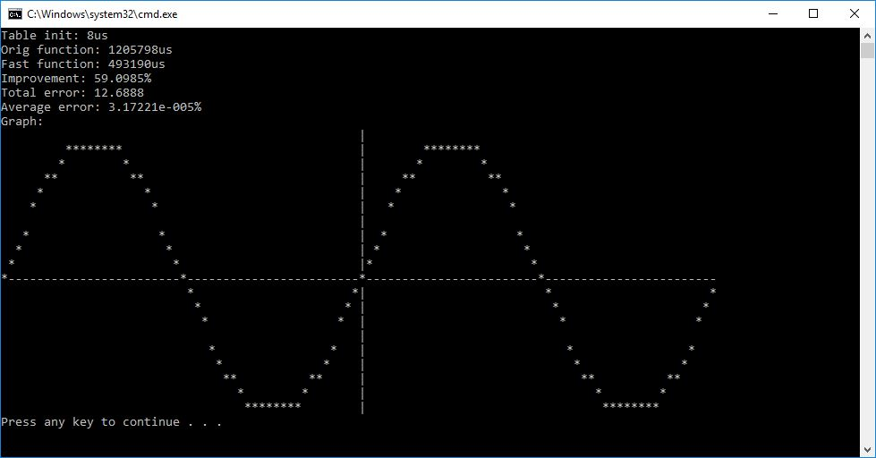

# sintab

A quick sine table test I did for.. something else :)

](screenie.jpg)

## description

This is an implementation of a table-based `sin` (and `cos`) replacement, useful for example in software synthesizers. It's not guaranteed to be the fastest around, but gained some quite noticeable speed gains in a certain sine-heavy project I have :) .

See [the implementation](main.cpp#L53) for more details.

Thanks to [kusma](https://github.com/kusma/) for taking this further and squeezing even more perf out of it :)

## license

This code is licensed under the MIT license (see LICENSE).
